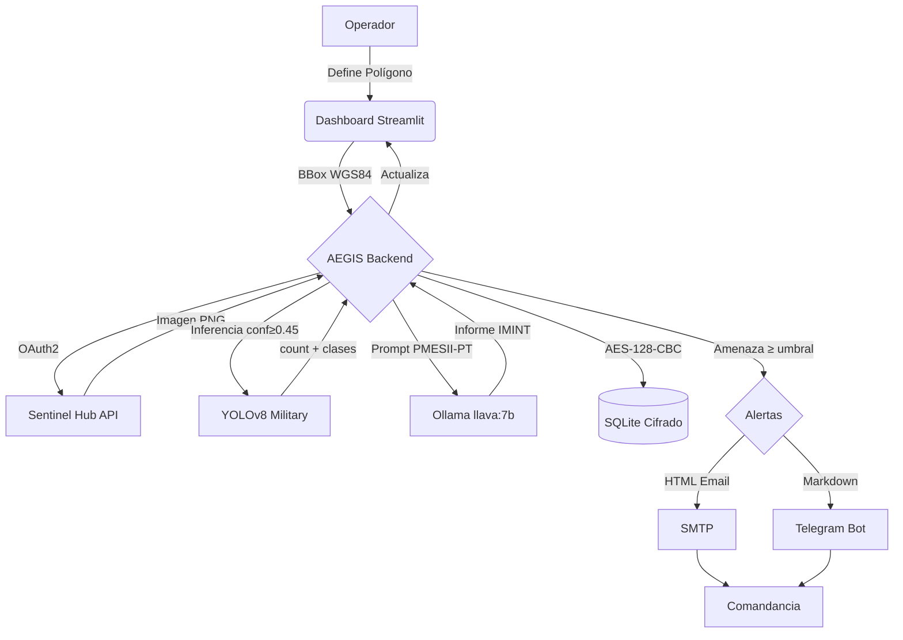
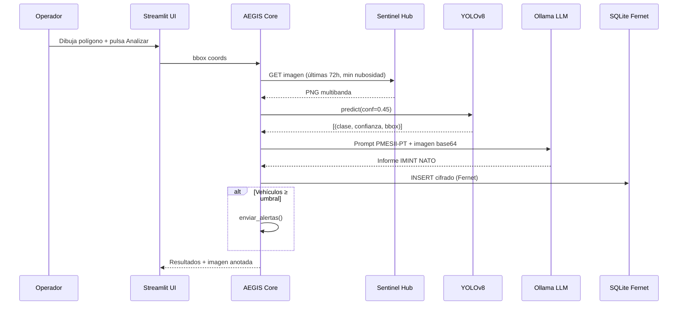

<div align="center">

# 🦅 AEGIS-IMINT: Monitoreo Satelital Militar
### *Inteligencia Estratégica y Seguridad de Vanguardia — v2.0*

[](https://opensource.org/licenses/MIT)
[](https://www.python.org/downloads/)
[](https://github.com/ultralytics/ultralytics)
[](https://ollama.ai)
[](https://www.sentinel-hub.com/)
[](https://docs.docker.com/compose/)

> **"Vigilancia incesante, respuesta inmediata."**  
> Sistema de análisis de imágenes satelitales impulsado por IA para la detección de vehículos militares, evaluación de amenazas y alerta temprana.

</div>

---

## 🪖 Características

- 📡 **Imágenes Sentinel-2 L1C** con selección automática de menor nubosidad
- 🎯 **Detección YOLOv8** con filtrado de clases militares (vehículos, aeronaves, navíos)
- 🧠 **Análisis IMINT con Ollama** (llava:7b) — Informes PMESII-PT en español, clasificación NATO
- 🚨 **Alertas duales** — Email HTML cifrado + Telegram Bot
- 🔐 **Cifrado Fernet** — Clave auto-generada, imágenes y base de datos protegidos
- 🗺️ **Dashboard Streamlit** — Mapa interactivo, historial, gestión de zonas
- 🐳 **Docker Compose** — Despliegue con Ollama sidecar (GPU si disponible)

---

## 🧠 Arquitectura del Sistema





---

## ⚙️ Instalación

### Requisitos
- Python 3.10+
- Cuenta [Sentinel Hub](https://www.sentinel-hub.com/) (gratis para uso limitado)
- [Ollama](https://ollama.ai) instalado localmente (opcional, para análisis LLM)

### Setup automático

**Linux / macOS:**
```bash
git clone https://github.com/murdok1982/MonitoreoSatelitalMilitar
cd MonitoreoSatelitalMilitar
bash setup.sh
# Edita .env con tus credenciales
bash start.sh
```

**Windows:**
```bat
git clone https://github.com/murdok1982/MonitoreoSatelitalMilitar
cd MonitoreoSatelitalMilitar
setup.bat
# Edita .env con tus credenciales
start.bat
```

**Docker:**
```bash
cp .env.example .env
# Edita .env
docker compose up -d
# Dashboard en http://localhost:8501
```

### Configuración `.env`

```env
# Sentinel Hub (requerido)
SENTINEL_CLIENT_ID=tu_client_id
SENTINEL_CLIENT_SECRET=tu_client_secret

# Modelo YOLO (ver /modelos/README.md)
YOLO_MODEL_PATH=modelos/yolov8_military.pt
CONFIDENCE_THRESHOLD=0.45

# Ollama (opcional - análisis IMINT)
OLLAMA_BASE_URL=http://localhost:11434
OLLAMA_MODEL=llava:7b

# Alertas Email
EMAIL_FROM=tu@gmail.com
EMAIL_PASSWORD=tu_app_password
EMAIL_TO=comandante@ejemplo.com

# Alertas Telegram (alternativa)
TELEGRAM_BOT_TOKEN=tu_bot_token
TELEGRAM_CHAT_ID=tu_chat_id

# Sensibilidad
SENSIBILIDAD_ALERTA=5
```

---

## 🤖 Modelo YOLO

Ver `/modelos/README.md` para instrucciones detalladas de descarga.

Datasets recomendados para entrenamiento:

| Dataset | Contenido | URL |
|---|---|---|
| xView | Vehículos, aeronaves, navíos satelitales | [xviewdataset.org](http://xviewdataset.org/) |
| DOTA | Objetos aéreos multi-clase (15 categorías) | [captain-whu.github.io/DOTA](https://captain-whu.github.io/DOTA/) |
| VEDAI | 3000 imágenes aéreas de vehículos | [VEDAI](https://downloads.greyc.fr/vedai/) |
| Military Aircraft | Aeronaves militares desde arriba | HuggingFace |

---

## 🗺️ Modos de Operación

| Modo | Función |
|---|---|
| **Monitoreo en Vivo** | Dibuja zona, descarga imagen Sentinel-2, detecta y genera informe IMINT |
| **Historial / Análisis** | Gráfico de tendencias, tabla de detecciones con informes LLM |
| **Zonas Guardadas** | Gestiona zonas predefinidas de vigilancia permanente |

---

## 📁 Estructura del Proyecto

```
MonitoreoSatelitalMilitar/
├── main.py                    # Aplicación Streamlit principal
├── config.py                  # Configuración desde .env
├── requirements.txt           # Dependencias pip
├── .env.example               # Plantilla de configuración
├── setup.sh / setup.bat       # Instalación automática
├── start.sh / start.bat       # Arranque rápido
├── Dockerfile                 # Imagen Docker
├── docker-compose.yml         # Stack completo con Ollama
├── utils/
│   ├── sentinel.py            # Descarga Sentinel-2 (fecha dinámica)
│   ├── detector.py            # YOLOv8 con filtrado militar
│   ├── ollama_analyst.py      # Análisis IMINT PMESII-PT
│   ├── alerts.py              # Email HTML + Telegram
│   ├── database.py            # SQLite thread-safe + zonas
│   └── crypto.py              # Cifrado Fernet
├── modelos/
│   └── README.md              # Instrucciones descarga de modelos
├── base_de_datos/             # SQLite (auto-creado)
├── imagenes/                  # Imágenes satelitales (auto-creado)
└── logs/                      # Logs de operación
```

---

## 🔐 Seguridad

- ✅ **Sin credenciales en código** — todo vía variables de entorno
- ✅ **Clave Fernet auto-generada** en `base_de_datos/.fernet_key` (chmod 600)
- ✅ **Alertas cifradas** en tránsito (STARTTLS SMTP, HTTPS Telegram)
- ✅ `.gitignore` excluye `.env`, `*.db`, imágenes, modelos y logs

> ⚠️ **SÓLO PARA USO AUTORIZADO** — Agencias gubernamentales, inteligencia militar y contratistas de defensa debidamente autorizados. Prohibido uso para vigilancia no autorizada.

---

## 💰 Apoya el Proyecto

```text
₿ Bitcoin: bc1qqphwht25vjzlptwzjyjt3sex7e3p8twn390fkw
```

---

## 🎖️ CONTACTO OFICIAL

**Autor:** murdok1982 (Gustavo Lobato Clara) · gustavolobatoclara@gmail.com

<details>
<summary><b>🚨 Reportar incidencia operativa</b></summary>
Asunto: [QUEJA] Sistema - Descripción · Incluir: incidencia, impacto, evidencia
</details>
<details>
<summary><b>🛠️ Reporte de instalación / despliegue</b></summary>
Asunto: [COMPILACIÓN] Falla en &lt;entorno&gt; · Incluir: OS, versiones, log completo
</details>
<details>
<summary><b>💡 Propuestas de mejora</b></summary>
Asunto: [PROPUESTA] Módulo/Mejora · Incluir: objetivo táctico, viabilidad técnica
</details>

---

> *"Si vis pacem, para bellum."*
