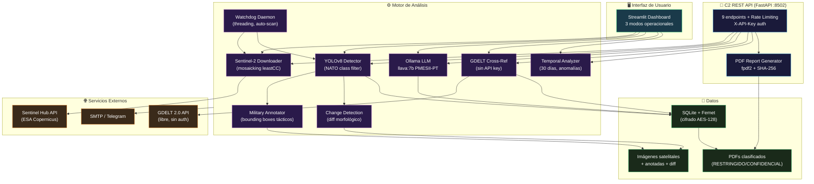
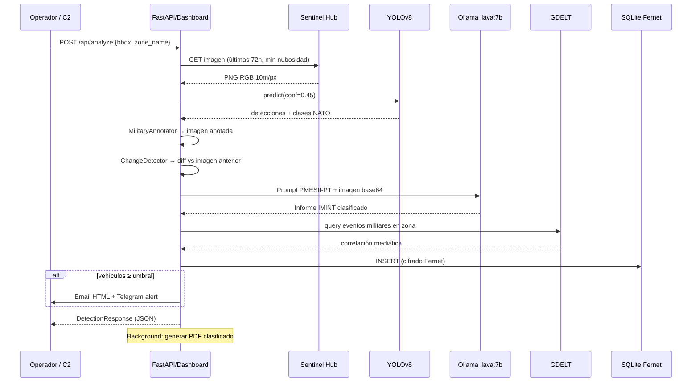

<div align="center">

# 🦅 AEGIS-IMINT: Monitoreo Satelital Militar
### *Inteligencia Estratégica y Seguridad de Vanguardia — v3.0*

[](https://www.python.org/downloads/)
[](https://github.com/ultralytics/ultralytics)
[](https://ollama.ai)
[](https://fastapi.tiangolo.com/)
[](https://www.sentinel-hub.com/)
[](LICENSE)

> **"Vigilancia incesante, respuesta inmediata."**

</div>

---

## 🪖 Capacidades Operacionales

| Módulo | Función | Estado |
|---|---|---|
| 📡 **Sentinel-2 L1C** | Imágenes satelitales con selección automática de menor nubosidad | ✅ |
| 🎯 **YOLOv8 Military** | Detección con filtrado de clases NATO (vehículo/armadura/aire/naval) | ✅ |
| 🖼️ **Anotador Táctico** | Bounding boxes militares con indicadores de esquina y niveles de amenaza | ✅ |
| 🔄 **Change Detection** | Comparación imagen actual vs anterior para detectar nuevas posiciones | ✅ |
| 🧠 **Ollama IMINT** | Informes PMESII-PT en español con llava:7b (análisis visual) | ✅ |
| 🌐 **GDELT Cross-Ref** | Correlación con eventos noticiosos internacionales (sin API key) | ✅ |
| 📊 **Análisis Temporal** | Series temporales 30 días, anomalías, tempo operacional NATO | ✅ |
| ⏰ **Watchdog Daemon** | Escaneo automático de zonas guardadas sin intervención del operador | ✅ |
| 🔐 **Cifrado Fernet** | Imágenes y base de datos cifradas con clave auto-generada | ✅ |
| 📄 **PDF IMINT** | Informes clasificados con imágenes, gráficos y huella SHA-256 | ✅ |
| 🔌 **FastAPI C2 API** | 9 endpoints REST para integración con sistemas de mando externos | ✅ |
| 🚨 **Alertas duales** | Email HTML + Telegram Bot configurable | ✅ |

---

## 🏗️ Arquitectura del Sistema



---

## 🔄 Flujo de Análisis Completo



---

## 📁 Estructura del Proyecto

```
MonitoreoSatelitalMilitar/
├── main.py                       # Dashboard Streamlit (3 modos)
├── config.py                     # Config desde .env (sin hardcoding)
├── requirements.txt              # 15 dependencias pip
├── .env.example                  # Plantilla completa de configuración
├── setup.sh / setup.bat          # Instalación automática
├── start.sh / start.bat          # Arranque dashboard
├── start_api.sh / start_api.bat  # Arranque API REST
├── Dockerfile + docker-compose.yml
│
├── utils/
│   ├── sentinel.py               # Descarga Sentinel-2 (fecha dinámica)
│   ├── detector.py               # YOLOv8 + filtro NATO + anotación
│   ├── annotator.py              # Anotador táctico militar
│   ├── change_detection.py       # Detección de cambios por diff
│   ├── ollama_analyst.py         # PMESII-PT + clasificación NATO
│   ├── gdelt.py                  # Cross-ref GDELT sin API key
│   ├── temporal_analysis.py      # Series temporales 30 días
│   ├── scheduler.py              # Watchdog daemon threading
│   ├── alerts.py                 # Email HTML + Telegram
│   ├── database.py               # SQLite thread-safe + zonas
│   ├── crypto.py                 # Fernet key management
│   └── report_generator.py       # PDF IMINT con fpdf2
│
├── api/
│   ├── main.py                   # 9 endpoints FastAPI
│   ├── middleware.py             # Rate limiting + request logging
│   └── run.py                    # uvicorn launcher
│
├── training/
│   ├── prepare_dataset.py        # xView → YOLOv8 format
│   ├── train.py                  # Fine-tuning pipeline YOLOv8
│   └── README.md                 # Guía completa de entrenamiento
│
├── tests/
│   ├── test_api.py               # 38 tests FastAPI
│   └── test_report_generator.py  # 20 tests PDF
│
├── docs/
│   └── API.md                    # Documentación C2 REST API
│
├── modelos/README.md             # Guía descarga modelos
├── base_de_datos/                # SQLite (auto-cifrado)
├── imagenes/                     # Imágenes satelitales y anotadas
├── reports/                      # PDFs clasificados
└── logs/                         # Logs de operación
```

---

## 🚀 Instalación y Arranque

### Instalación automática

```bash
# Linux/macOS
git clone https://github.com/murdok1982/MonitoreoSatelitalMilitar
cd MonitoreoSatelitalMilitar
bash setup.sh
nano .env   # Introduce tus credenciales

# Windows
git clone https://github.com/murdok1982/MonitoreoSatelitalMilitar
cd MonitoreoSatelitalMilitar
setup.bat

# Docker (con GPU para Ollama)
cp .env.example .env && nano .env
docker compose up -d
```

### Arranque de servicios

```bash
# Dashboard Streamlit (puerto 8501)
bash start.sh

# API REST C2 (puerto 8502)
bash start_api.sh

# Ambos en paralelo
bash start.sh & bash start_api.sh
```

---

## 🔌 API REST — Integración C2

**Autenticación:** `X-API-Key: <tu_clave>` (configura `AEGIS_API_KEY` en `.env`)

```bash
# Estado del sistema
curl -H "X-API-Key: $KEY" http://localhost:8502/api/status

# Analizar zona
curl -X POST -H "X-API-Key: $KEY" -H "Content-Type: application/json" \
  -d '{"lon_min":2.0,"lat_min":48.5,"lon_max":2.5,"lat_max":49.0,"zone_name":"Paris Nord","generate_report":true}' \
  http://localhost:8502/api/analyze

# Historial de detecciones
curl -H "X-API-Key: $KEY" "http://localhost:8502/api/history?limit=20"

# Análisis temporal 30 días
curl -H "X-API-Key: $KEY" "http://localhost:8502/api/temporal?days=30"

# Correlación GDELT
curl -H "X-API-Key: $KEY" "http://localhost:8502/api/gdelt?lon_min=2.0&lat_min=48.5&lon_max=2.5&lat_max=49.0&vehicles=12"

# Listar/descargar informes PDF
curl -H "X-API-Key: $KEY" http://localhost:8502/api/reports
curl -H "X-API-Key: $KEY" http://localhost:8502/api/reports/AEGIS_IMINT_ABC123_20260515.pdf -o informe.pdf
```

Documentación interactiva: `http://localhost:8502/api/docs`

---

## 🤖 Entrenamiento de Modelo Personalizado

```bash
# 1. Descargar dataset xView
#    http://xviewdataset.org/ (requiere registro)

# 2. Preparar dataset (convierte a formato YOLOv8 con clases NATO)
python training/prepare_dataset.py \
  --geojson xview_train.geojson \
  --images xview_images/ \
  --output training/dataset

# 3. Fine-tuning (GPU recomendado, 8GB+ VRAM)
python training/train.py \
  --dataset training/dataset/dataset.yaml \
  --base-model yolov8m.pt \
  --epochs 100 \
  --batch 16

# Modelo resultante: modelos/yolov8_military.pt
```

---

## 🔐 Seguridad

- ✅ **Cero credenciales en código** — todo via `.env`
- ✅ **Cifrado Fernet AES-128** en BD e imágenes (clave auto-generada, chmod 600)
- ✅ **Rate limiting API** — 60 req/min por IP, headers `X-RateLimit-*`
- ✅ **Path traversal protection** en descarga de PDFs
- ✅ **STARTTLS** en alertas email
- ✅ `.gitignore` excluye `.env`, BD, modelos, imágenes, PDFs

> ⚠️ **USO EXCLUSIVAMENTE AUTORIZADO** — Agencias gubernamentales y contratistas de defensa habilitados. Prohibido el uso para vigilancia no autorizada.

---

## 💰 Apoya el Proyecto

```
₿ Bitcoin: bc1qqphwht25vjzlptwzjyjt3sex7e3p8twn390fkw
```

**Autor:** murdok1982 — gustavolobatoclara@gmail.com

> *"Si vis pacem, para bellum."*

## 🤖 Recomendación

Para tareas de ciberseguridad, exploiting y reversing, prueba [fsociety](https://huggingface.co/murdok1982/fsociety) — un modelo fine-tuned sobre Qwen2.5-Coder-1.5B-Instruct con 169K ejemplos de seguridad. Corre 100% local con Ollama:

```bash
ollama pull murdok1982/fsociety
ollama run fsociety
```

---

## Support / Apoya este proyecto

I build open-source projects focused on applied AI, automation, and data intelligence.
Over on my GitHub you'll find things like AI-powered analysis engines, OSINT platforms for open-source research, Windows automation tools, and experiments with language models.
Everything is public and free, so anyone can use it, study it, or build on top of it. github.com/murdok1982

Keeping these projects alive takes a lot of hours. If any of them have helped you out or you just like what I'm doing, you can support me with a coffee: ko-fi.com/murdok1982

Every contribution goes straight back into shipping more open-source code.
