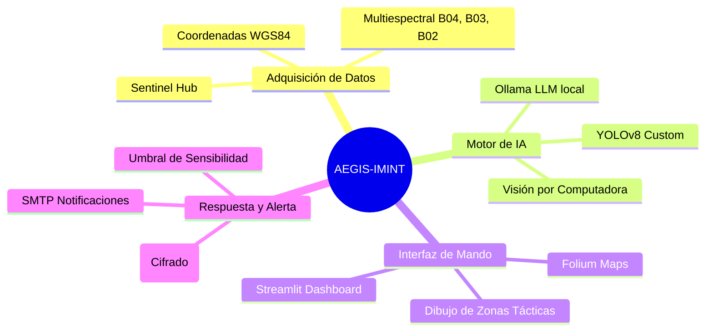
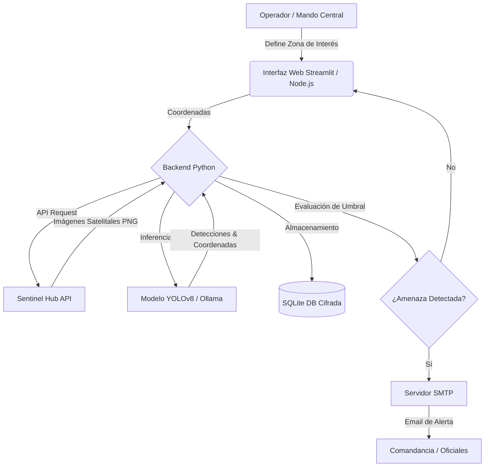
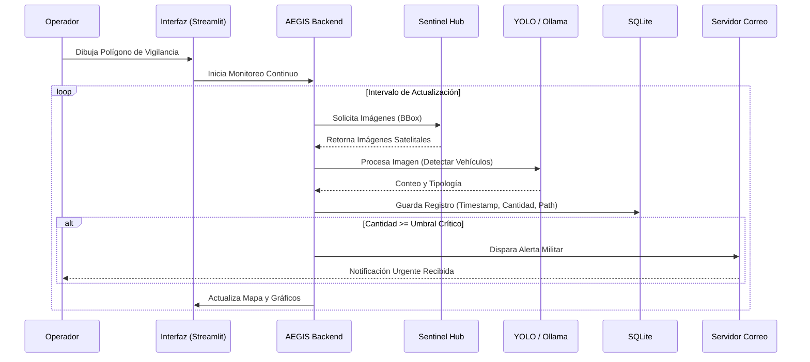

<div align="center">

# 🦅 AEGIS-IMINT: Monitoreo Satelital Militar
### *Inteligencia Estratégica y Seguridad de Vanguardia*

[](https://opensource.org/licenses/MIT)
[](https://www.python.org/downloads/)
[](https://github.com/ultralytics/ultralytics)
[](https://www.sentinel-hub.com/)
[](#)

> **"Vigilancia incesante, respuesta inmediata."**
> Sistema avanzado de análisis de imágenes satelitales impulsado por Inteligencia Artificial para la detección de vehículos militares, evaluación de amenazas y alerta temprana. Utiliza visión por computadora y aprendizaje automático para identificar y rastrear activos militares.

<br/>


</div>

---

## 🪖 Características Principales

- 📡 **Análisis de Imágenes Satelitales**: Procesamiento en tiempo real (Sentinel-2 L1C).
- 🎯 **Detección Táctica**: Identificación de vehículos militares mediante redes neuronales (YOLOv8).
- 🗺️ **Rastreo Geoespacial**: Visualización en mapas interactivos (Folium/Streamlit).
- 🚨 **Sistema de Alerta Temprana**: Notificaciones automatizadas vía SMTP en caso de incursiones.
- 💾 **Registro Histórico**: Almacenamiento seguro en SQLite para análisis forense y reconocimiento de patrones.
- 🔐 **Arquitectura Segura**: Cifrado de base de datos y comunicaciones.

---

## 🧠 Mapa Conceptual del Sistema



---

## ⚙️ Arquitectura del Sistema



---

## 🔄 Flujo de Operación (Diagrama de Secuencia)



---

## 🚀 Instalación y Despliegue

### Requisitos Previos

- Python 3.10+
- Node.js 18+ (Para el frontend avanzado)
- Cuenta en [Sentinel Hub](https://www.sentinel-hub.com/)
- [Ollama](https://ollama.ai) instalado localmente (Opcional para análisis heurístico)

### Pasos de Configuración

1. **Clonar el repositorio y ejecutar el setup automatizado**:
   ```cmd
   git clone https://github.com/murdok1982/MonitoreoSatelitalMilitar.git
   cd MonitoreoSatelitalMilitar
   setup.bat
   ```
2. **Configurar credenciales**:
   El script `setup.bat` generará automáticamente un archivo `.env` con claves criptográficas. Debes editarlo y proporcionar:
   - `SENTINEL_CLIENT_ID` y `SENTINEL_CLIENT_SECRET`
   - Credenciales SMTP para las alertas.
3. **Descargar modelos de IA**:
   Coloca tus modelos pre-entrenados (ej. `yolov8_military.pt`) en el directorio `/modelos`.
4. **Iniciar el sistema**:
   - Backend: `start_backend.bat`
   - Frontend: `start_frontend.bat`

---

## 💰 Apoya este Proyecto (Support)

<div align="center">

### ₿ Donaciones en Bitcoin

El desarrollo de sistemas de defensa y seguridad requiere recursos constantes. Tu apoyo es fundamental.


```text
┌─────────────────────────────────────┐
│    ₿  BTC Donation Address  ₿      │
├─────────────────────────────────────┤
│                                     │
│  bc1qqphwht25vjzlptwzjyjt3sex     │
│  7e3p8twn390fkw                    │
│                                     │
│  Network: Bitcoin (BTC)             │
│  Scan QR ↓                          │
└─────────────────────────────────────┘
```


**Address:** `bc1qqphwht25vjzlptwzjyjt3sex7e3p8twn390fkw`

*¡Tus donaciones ayudan a mantener operativa esta tecnología estratégica!* 🙏

</div>

---

## 🛡️ Seguridad y Consideraciones Éticas

### Medidas Implementadas
- ✅ Bases de datos y archivos de imagen cifrados mediante Fernet (claves autogeneradas).
- ✅ Credenciales inyectadas por variables de entorno (`.env`), nunca en código fuente.
- ✅ Autenticación JWT en el panel de control.

### Descargo de Responsabilidad (Disclaimer)
⚠️ **SÓLO PARA USO AUTORIZADO** ⚠️
Este software está diseñado para agencias gubernamentales, inteligencia militar, y contratistas de defensa debidamente autorizados.
El uso para espionaje comercial, vigilancia no autorizada o violación de derechos de privacidad está estrictamente prohibido y penado por la ley.

---

## 👤 Autor e Información de Contacto

**Arquitecto de Inteligencia Artificial:** murdok1982 (Gustavo Lobato Clara)

- 🐙 GitHub: [@murdok1982](https://github.com/murdok1982)
- 💼 LinkedIn: [Gustavo Lobato Clara](https://www.linkedin.com/in/gustavo-lobato-clara-2b446b102/)
- 📧 Email: gustavolobatoclara@gmail.com

---

> *"Si vis pacem, para bellum."* — Si quieres la paz, prepárate para la guerra.

<div align="center">
  <br>
  ⭐ <b>Si consideras este sistema útil para tus operaciones, no olvides darle una estrella en GitHub.</b>
</div>