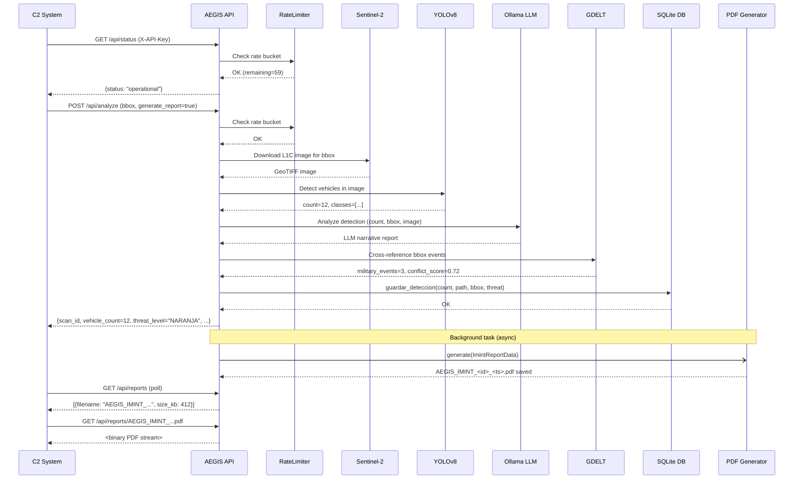

# AEGIS-IMINT REST API — Developer & C2 Integration Guide

**Version:** 2.0.0  
**Base URL:** `http://<host>:<port>` (default port: `8502`)  
**Interactive docs:** `GET /api/docs` (Swagger UI) · `GET /api/redoc` (ReDoc)

---

## Table of Contents

1. [Authentication](#authentication)
2. [Rate Limiting](#rate-limiting)
3. [Endpoints](#endpoints)
   - [GET /api/status](#get-apistatus)
   - [POST /api/analyze](#post-apianalyze)
   - [GET /api/history](#get-apihistory)
   - [GET /api/temporal](#get-apitemporal)
   - [POST /api/zones](#post-apizones)
   - [GET /api/zones](#get-apizones)
   - [GET /api/gdelt](#get-apigdelt)
   - [GET /api/reports](#get-apireports)
   - [GET /api/reports/{filename}](#get-apireportsfilename)
4. [Response Schemas](#response-schemas)
5. [Error Codes](#error-codes)
6. [C2 Integration Guide](#c2-integration-guide)
7. [Rate Limiting Recommendations](#rate-limiting-recommendations)
8. [Call Flow — Sequence Diagram](#call-flow--sequence-diagram)

---

## Authentication

All endpoints (except the OpenAPI spec pages) require an API key passed in
the `X-API-Key` HTTP request header.

```
X-API-Key: <your-api-key>
```

The server-side key is configured via the `AEGIS_API_KEY` environment variable.
The default development key `aegis-dev-key-change-in-production` **must** be
rotated before deploying to any production or exercise environment.

**Wrong or missing key → HTTP 403 Forbidden.**

```bash
# Example — valid key
curl -s -H "X-API-Key: $AEGIS_API_KEY" http://localhost:8502/api/status

# Example — missing key (403)
curl -s http://localhost:8502/api/status
```

---

## Rate Limiting

The API applies a **sliding-window rate limiter** per client IP address.

| Parameter       | Default |
|-----------------|---------|
| Max requests    | 60      |
| Window          | 60 s    |

Responses include informational headers:

| Header                  | Description                                      |
|-------------------------|--------------------------------------------------|
| `X-RateLimit-Limit`     | Maximum requests allowed in the window           |
| `X-RateLimit-Remaining` | Requests remaining in the current window         |
| `X-RateLimit-Window`    | Window length in seconds                         |
| `Retry-After`           | Seconds to wait before retrying (429 only)       |

When the limit is exceeded the server returns:

```
HTTP/1.1 429 Too Many Requests
Retry-After: 60
Content-Type: application/json

{"detail": "Rate limit exceeded. Try again later."}
```

---

## Endpoints

### GET /api/status

Returns the operational status of the AEGIS-IMINT system.

**Tags:** Sistema  
**Auth:** Required

**curl example:**

```bash
curl -s \
  -H "X-API-Key: $AEGIS_API_KEY" \
  http://localhost:8502/api/status | python3 -m json.tool
```

**Response 200:**

```json
{
  "status": "operational",
  "version": "2.0.0",
  "ollama_available": true,
  "db_path": "aegis.db",
  "timestamp": "2025-06-01T12:00:00.000000+00:00"
}
```

---

### POST /api/analyze

Perform a full IMINT analysis of a geographic bounding box.

**Tags:** Analisis  
**Auth:** Required

The endpoint:

1. Downloads a Sentinel-2 L1C image for the requested bbox (requires
   `SENTINEL_CLIENT_ID` / `SENTINEL_CLIENT_SECRET` env vars).
2. Runs YOLOv8 military vehicle detection (requires `YOLO_MODEL_PATH`).
3. Calls Ollama LLM for narrative intelligence assessment.
4. Cross-references GDELT for correlated media events.
5. Persists results to the SQLite database.
6. Optionally generates a classified PDF report in the background.

In **demo mode** (missing Sentinel credentials or YOLO model), synthetic
vehicle counts are returned so downstream C2 workflows can be tested without
satellite access.

**Request body (JSON):**

```json
{
  "lon_min": -3.7,
  "lat_min": 40.4,
  "lon_max": -3.6,
  "lat_max": 40.5,
  "zone_name": "Zona Alpha",
  "generate_report": false,
  "alert_threshold": 5
}
```

| Field             | Type    | Required | Description                                          |
|-------------------|---------|----------|------------------------------------------------------|
| `lon_min`         | float   | Yes      | Western longitude boundary (WGS84 decimal degrees)   |
| `lat_min`         | float   | Yes      | Southern latitude boundary                           |
| `lon_max`         | float   | Yes      | Eastern longitude boundary                           |
| `lat_max`         | float   | Yes      | Northern latitude boundary                           |
| `zone_name`       | string  | No       | Human-readable zone label (default: "API Zone")      |
| `generate_report` | boolean | No       | Generate PDF in background (default: false)          |
| `alert_threshold` | int     | No       | Vehicle count that triggers alert channels           |

**curl example:**

```bash
curl -s -X POST \
  -H "X-API-Key: $AEGIS_API_KEY" \
  -H "Content-Type: application/json" \
  -d '{"lon_min":-3.7,"lat_min":40.4,"lon_max":-3.6,"lat_max":40.5}' \
  http://localhost:8502/api/analyze | python3 -m json.tool
```

**Response 200:**

```json
{
  "scan_id": "A3F9B2C1",
  "timestamp": "2025-06-01T12:01:00.000000+00:00",
  "vehicle_count": 12,
  "threat_level": "NARANJA",
  "threat_action": "Alert command",
  "bbox": [-3.7, 40.4, -3.6, 40.5],
  "llm_report": "IMINT assessment: 12 armoured vehicles...",
  "gdelt_summary": "3 military events detected in last 72h...",
  "alert_sent": true
}
```

---

### GET /api/history

Retrieve the most recent detection records.

**Tags:** Historial  
**Auth:** Required

**Query parameters:**

| Param   | Type | Default | Description           |
|---------|------|---------|-----------------------|
| `limit` | int  | 50      | Number of rows to return |

**curl example:**

```bash
curl -s \
  -H "X-API-Key: $AEGIS_API_KEY" \
  "http://localhost:8502/api/history?limit=10" | python3 -m json.tool
```

**Response 200:**

```json
[
  {
    "timestamp": "2025-06-01T12:01:00Z",
    "vehicle_count": 12,
    "threat_level": "NARANJA",
    "has_report": true
  }
]
```

---

### GET /api/temporal

Multi-temporal statistical analysis over a rolling window.

**Tags:** Analisis  
**Auth:** Required

**Query parameters:**

| Param  | Type | Default | Description              |
|--------|------|---------|--------------------------|
| `days` | int  | 30      | Number of days to analyse |

**curl example:**

```bash
curl -s \
  -H "X-API-Key: $AEGIS_API_KEY" \
  "http://localhost:8502/api/temporal?days=7" | python3 -m json.tool
```

**Response 200** (or `null` if insufficient data):

```json
{
  "zone_label": "Zona Alpha",
  "period_days": 7,
  "mean_vehicles": 8.4,
  "trend": "increasing",
  "operational_tempo": "HIGH",
  "anomaly_days": ["2025-05-29", "2025-05-31"],
  "summary": "Vehicle activity increased 40% over the period..."
}
```

---

### POST /api/zones

Register a new surveillance zone.

**Tags:** Zonas  
**Auth:** Required

**Request body:**

```json
{
  "nombre": "Zona Bravo",
  "lon_min": -5.0,
  "lat_min": 36.0,
  "lon_max": -4.5,
  "lat_max": 36.5
}
```

**curl example:**

```bash
curl -s -X POST \
  -H "X-API-Key: $AEGIS_API_KEY" \
  -H "Content-Type: application/json" \
  -d '{"nombre":"Zona Bravo","lon_min":-5.0,"lat_min":36.0,"lon_max":-4.5,"lat_max":36.5}' \
  http://localhost:8502/api/zones
```

**Response 200:**

```json
{"status": "created", "nombre": "Zona Bravo", "bbox": [-5.0, 36.0, -4.5, 36.5]}
```

---

### GET /api/zones

List all registered surveillance zones.

**Tags:** Zonas  
**Auth:** Required

**curl example:**

```bash
curl -s \
  -H "X-API-Key: $AEGIS_API_KEY" \
  http://localhost:8502/api/zones | python3 -m json.tool
```

**Response 200:**

```json
[
  {"id": 1, "nombre": "Zona Alpha", "bbox": [-3.7, 40.4, -3.6, 40.5], "activa": true},
  {"id": 2, "nombre": "Zona Bravo", "bbox": [-5.0, 36.0, -4.5, 36.5], "activa": true}
]
```

---

### GET /api/gdelt

GDELT Global Database of Events, Language, and Tone cross-reference for a
geographic area. Returns media-sourced military events correlated to the bbox.

**Tags:** Analisis  
**Auth:** Required

**Query parameters:**

| Param      | Type  | Required | Description             |
|------------|-------|----------|-------------------------|
| `lon_min`  | float | Yes      | Western boundary        |
| `lat_min`  | float | Yes      | Southern boundary       |
| `lon_max`  | float | Yes      | Eastern boundary        |
| `lat_max`  | float | Yes      | Northern boundary       |
| `vehicles` | int   | No       | Detected vehicle count  |

**curl example:**

```bash
curl -s \
  -H "X-API-Key: $AEGIS_API_KEY" \
  "http://localhost:8502/api/gdelt?lon_min=-3.7&lat_min=40.4&lon_max=-3.6&lat_max=40.5&vehicles=12" \
  | python3 -m json.tool
```

**Response 200:**

```json
{
  "bbox": [-3.7, 40.4, -3.6, 40.5],
  "military_events": 3,
  "conflict_score": 0.72,
  "threat_correlation": "HIGH",
  "summary": "3 military events detected in last 72h...",
  "events": [
    {
      "date": "2025-06-01",
      "description": "Military convoy movement reported near...",
      "goldstein": -4.5,
      "url": "https://example.com/news/..."
    }
  ]
}
```

---

### GET /api/reports

List all generated PDF reports.

**Tags:** Informes  
**Auth:** Required

**curl example:**

```bash
curl -s \
  -H "X-API-Key: $AEGIS_API_KEY" \
  http://localhost:8502/api/reports
```

**Response 200:**

```json
[
  {"filename": "AEGIS_IMINT_A3F9B2C1_20250601_120100.pdf", "size_kb": 412}
]
```

---

### GET /api/reports/{filename}

Download a specific PDF report by filename.

**Tags:** Informes  
**Auth:** Required

**Path parameters:**

| Param      | Type   | Description                   |
|------------|--------|-------------------------------|
| `filename` | string | Exact PDF filename (no paths) |

**curl example:**

```bash
curl -s \
  -H "X-API-Key: $AEGIS_API_KEY" \
  http://localhost:8502/api/reports/AEGIS_IMINT_A3F9B2C1_20250601_120100.pdf \
  --output report.pdf
```

Returns `application/pdf` binary stream on success, HTTP 404 if not found,
HTTP 400 if filename contains path traversal characters or non-PDF extension.

---

## Response Schemas

### DetectionResponse

```
scan_id         string    8-character uppercase scan identifier
timestamp       string    ISO8601 UTC timestamp
vehicle_count   int       Total vehicles detected
threat_level    string    VERDE | AMARILLO | NARANJA | ROJO
threat_action   string    Recommended C2 action
bbox            array     [lon_min, lat_min, lon_max, lat_max]
llm_report      string?   LLM narrative (null if Ollama unavailable)
gdelt_summary   string?   GDELT correlation summary
alert_sent      bool      Whether alert channels were triggered
```

### StatusResponse

```
status           string    "operational"
version          string    API version string
ollama_available bool      Ollama LLM reachable
db_path          string    Path to SQLite database
timestamp        string    ISO8601 UTC
```

### HistoryItem

```
timestamp       string    ISO8601 UTC
vehicle_count   int
threat_level    string?
has_report      bool
```

### TemporalResponse

```
zone_label         string
period_days        int
mean_vehicles      float
trend              string    "increasing" | "decreasing" | "stable"
operational_tempo  string
anomaly_days       array     List of ISO date strings
summary            string
```

---

## Error Codes

| HTTP Code | Meaning                              |
|-----------|--------------------------------------|
| 200       | Success                              |
| 400       | Bad request (invalid parameters)     |
| 403       | Forbidden — missing or invalid API key |
| 404       | Resource not found                   |
| 422       | Validation error (malformed JSON)    |
| 429       | Rate limit exceeded                  |
| 503       | Upstream service unavailable (Sentinel/YOLO) |

All error responses follow FastAPI's default shape:

```json
{"detail": "Human-readable error message"}
```

---

## C2 Integration Guide

### Step 1 — Environment configuration

```bash
export AEGIS_API_KEY="your-production-key"
export API_PORT=8502
export AEGIS_DB_PATH="/data/aegis/aegis.db"
export SENTINEL_CLIENT_ID="..."
export SENTINEL_CLIENT_SECRET="..."
export YOLO_MODEL_PATH="/models/yolov8_military.pt"
export OLLAMA_BASE_URL="http://ollama-host:11434"
export OLLAMA_MODEL="llama3"
```

### Step 2 — Health check before tasking

C2 systems should call `GET /api/status` before submitting analysis tasks:

```python
import httpx

BASE = "http://aegis-host:8502"
HEADERS = {"X-API-Key": "your-key"}

status = httpx.get(f"{BASE}/api/status", headers=HEADERS).json()
if status["status"] != "operational":
    raise RuntimeError("AEGIS not ready")
```

### Step 3 — Submit analysis task

```python
payload = {
    "lon_min": -3.7,
    "lat_min": 40.4,
    "lon_max": -3.6,
    "lat_max": 40.5,
    "zone_name": "Zona Alpha",
    "generate_report": True,
    "alert_threshold": 5,
}
result = httpx.post(f"{BASE}/api/analyze", json=payload,
                    headers=HEADERS, timeout=120).json()

print(f"Scan {result['scan_id']}: {result['vehicle_count']} vehicles, "
      f"threat={result['threat_level']}")
```

### Step 4 — Poll for generated PDF

```python
import time

def wait_for_report(scan_id: str, max_wait: int = 60):
    for _ in range(max_wait):
        reports = httpx.get(f"{BASE}/api/reports", headers=HEADERS).json()
        matching = [r for r in reports if scan_id in r["filename"]]
        if matching:
            return matching[0]["filename"]
        time.sleep(2)
    return None

filename = wait_for_report(result["scan_id"])
if filename:
    pdf_bytes = httpx.get(f"{BASE}/api/reports/{filename}",
                          headers=HEADERS).content
    with open(f"reports/{filename}", "wb") as fh:
        fh.write(pdf_bytes)
```

### Step 5 — Register persistent surveillance zones

```python
httpx.post(f"{BASE}/api/zones", headers=HEADERS, json={
    "nombre": "Zona Bravo",
    "lon_min": -5.0, "lat_min": 36.0,
    "lon_max": -4.5, "lat_max": 36.5,
})
```

### Polling loop for automated C2 integration

```python
import schedule, time

def scheduled_scan():
    zones = httpx.get(f"{BASE}/api/zones", headers=HEADERS).json()
    for zone in zones:
        b = zone["bbox"]
        httpx.post(f"{BASE}/api/analyze", headers=HEADERS, json={
            "lon_min": b[0], "lat_min": b[1],
            "lon_max": b[2], "lat_max": b[3],
            "zone_name": zone["nombre"],
            "generate_report": True,
        }, timeout=180)

schedule.every(30).minutes.do(scheduled_scan)

while True:
    schedule.run_pending()
    time.sleep(1)
```

---

## Rate Limiting Recommendations

For production deployments:

1. **Deploy behind a reverse proxy** (nginx/Caddy) that enforces additional
   per-IP and per-key limits at the network layer.

2. **Use a shared Redis backend** for the rate limiter when running multiple
   uvicorn workers (`--workers N`). The in-memory `defaultdict` is per-process
   and does not share state across workers.

3. **Recommended limits per integration tier:**

   | Tier              | Max req/min | Notes                           |
   |-------------------|-------------|---------------------------------|
   | C2 System         | 30          | Single trusted backend system   |
   | Analyst Workstation | 10        | Per-user interactive access     |
   | Automated Pipeline | 60         | High-frequency polling          |

4. **Satellite download latency:** `POST /api/analyze` can take 30–120 seconds
   when Sentinel download is active. Configure HTTP client timeouts of at least
   180 s.

5. **PDF generation** is asynchronous (BackgroundTasks). Poll `/api/reports`
   every 5–10 seconds after an `analyze` call with `generate_report: true`.

---

## Call Flow — Sequence Diagram


